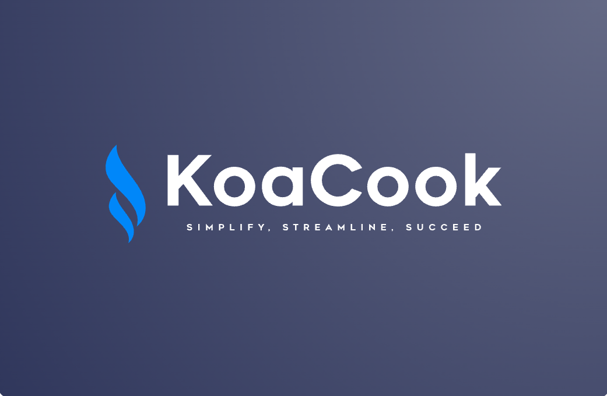

<div align="center">
  
  
</div>

<br/>

# KoaCook - All-in-one Restaurant Management System 🚀

Welcome to the KoaCook repository! This is the core hub for [KoaCook](https://koacook.com), an all-in-one platform designed to simplify and streamline your restaurant operations. With KoaCook, manage your restaurant seamlessly, from reservations and menu management to staff scheduling and customer insights.

## 🏆 Mission

KoaCook’s mission is to revolutionize restaurant management by offering powerful tools that enhance productivity, improve customer experience, and drive growth. Our platform aims to make running a restaurant more efficient and effective, helping you focus on what matters most: your customers.

## ✨ Features

KoaCook is packed with features to support your restaurant's needs:

-   ✅ **Order Management** – Streamline orders and improve service efficiency.
-   🍽 **Table Reservations** – Easily manage customer reservations.
-   📦 **Inventory Tracking** – Keep track of stock and minimize waste.
-   👥 **Staff Scheduling** – Efficiently schedule your team and avoid overstaffing.
-   📊 **Customer Insights** – Gain valuable insights into customer preferences and behavior.
-   🌍 **Multi-location Management** – Manage multiple restaurant locations from one place.

## 🚀 Getting Started

Follow these instructions to set up KoaCook locally.

### 📥 Clone the repository

```bash
git clone https://github.com/koacook/landing_page
cd landing_page
```

### ⚙️ Setup Environment

Create a **.env.local** file and add your environment variables:

```bash
EMAIL_USER="your-email"
EMAIL_PASS="your-app-pass"
```

### 🛠 Install Dependencies

Run the following command:

```bash
npm install
```

### ▶️ Run the Application

```bash
npm run dev
```

Now open your browser and navigate to http://localhost:3000 to see KoaCook in action.

## 👥 Contributing

We are excited to have you as part of the KoaCook community! If you'd like to contribute, please follow these steps:

1. Fork the repository and create a new branch.
2. Make your changes and add tests if applicable.
3. Create a pull request for review.

Before contributing, make sure to read our contribution guidelines.

## 🌍 Join Our Community

We’d love to have you as part of our community! Join us on:

-   💬 [Linkedin](https://linkedin.com/company/koacookofficial) – Company details, discussion, contact.
-   🐦 [X](https://x.com/@koacookofficial) – Latest updates.
-   📸 [Instagram](https://instagram.com/koacookofficial) – Behind-the-scenes content.
-   📘 [Facebook](https://facebook.com/koacookofficial) – Community updates.

## 📩 Contact Us

For any questions or feedback, feel free to reach out to us at support@koacook.com.

Thank you for checking out KoaCook! 🎉 We can’t wait for you to experience the future of restaurant management.
